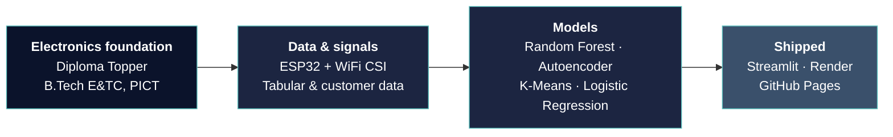

 

 

## ⚡ At a Glance

<table>
  <tr align="center">
    <td width="20%"><h2>🥇 1st</h2>UpXGen Hackathon PVGCOE Nashik, 2024</td>
    <td width="20%"><h2>5</h2>End-to-end projects built</td>
    <td width="20%"><h2>4</h2>Deployed & publicly live</td>
    <td width="20%"><h2>9.05</h2>SGPA B.Tech, PICT Pune</td>
    <td width="20%"><h2>96.82%</h2>Diploma Topper CWIT Pune</td>
  </tr>
</table>

 

## 🧭 How I Build

I started in electronics, so I think in terms of **signals, systems and pipelines**. Every project below follows the same path: raw data, then a model, then something people can actually open and use.

 

## 👩‍💻 About

I'm a third-year B.Tech student at **PICT Pune**, in Electronics & Telecommunication. I came in through the Diploma-to-Degree pathway after topping my diploma class.

I'm drawn to problems where **ML meets something physical or practical**: sensing, anomaly detection, prediction, segmentation. My habit is to compare several models, pick the one the data supports, and deploy it rather than leave it in a notebook.

**Looking for:** internships in Data Science, Analytics, or Full Stack Development.

 

## 🧰 Tech Stack

**Languages** 

**ML & Data** 

**Web & Backend** 

**Deploy & Tools** 

 

-0b132b?style=flat-square)

 

## 📂 Case Files — Featured Projects

| # | Project | Domain | Core Technique | Status |
|:-:|---|---|---|:-:|
| 01 | **Digitwin.AI** | Predictive maintenance | Autoencoder anomaly detection | 🥇 Hackathon winner · [Live](https://digitwin58.onrender.com/) |
| 02 | **WiFi Human Sensing** | Embedded ML / IoT | CSI signals + Random Forest | [Repo](https://github.com/anuja-naik/Human-Detection-Using-WiFi) |
| 03 | **CreditWise** | Finance ML | Logistic Regression (87.5%) | [Live](https://creditwise-loan-prediction-system-mgd3savehoyqda7kf7rpub.streamlit.app/) |
| 04 | **SmartCart** | Unsupervised ML | PCA + K-Means | [Live](https://shareappio-ktudjssrkceywppsmev2ck.streamlit.app/) |
| 05 | **D2D Guidance** | Web / community | HTML · CSS · JS | [Live](https://anuja-naik.github.io/Bridging-The-Next-Step-D2D-Guidance/) |

<b>🥇 01 · Digitwin.AI — AI Predictive Maintenance System</b> &nbsp;·&nbsp; <i>1st place, UpXGen Hackathon</i>

 

- **Problem:** equipment failures are expensive when they're only noticed after they happen.
- **What the team built:** an AI-based predictive maintenance system using **Digital Twin** concepts and an **Autoencoder** for anomaly detection, with a real-time monitoring dashboard.
- **My part:** the **Flask backend and REST API integration** that connected the model output to the frontend dashboard.
- **Stack:** `Python` `Flask` `REST APIs` `Autoencoder` `Digital Twin`
- **Result:** 1st place at UpXGen Hackathon, PVGCOE Nashik, against teams from across Maharashtra.

[🔗 Live Demo](https://digitwin58.onrender.com/) &nbsp;·&nbsp; [📁 Repository](https://github.com/anuja-naik/AI-Predictive-Maintenance-Digital-Twin)

<b>📡 02 · Human Detection Using WiFi Signals</b> &nbsp;·&nbsp; <i>ESP32 + ML, no camera needed</i>

 

- **Problem:** sensing people usually needs cameras or wearables, which brings privacy and cost issues.
- **What I built:** a sensing system that reads **WiFi Channel State Information (CSI)** through an **ESP32** and classifies human activity (walking, sitting, standing) with a **Random Forest** model.
- **Highlights:** feature extraction from wireless signals, and an ML prediction pipeline for an embedded setting.
- **Stack:** `Python` `ESP32` `Random Forest` `Signal Processing`

[📁 Repository](https://github.com/anuja-naik/Human-Detection-Using-WiFi)

<b>💳 03 · CreditWise — Loan Approval Prediction</b> &nbsp;·&nbsp; <i>3 models compared, best at 87.5%</i>

 

- **What I built:** an end-to-end pipeline covering EDA, preprocessing, and feature engineering (including engineered quadratic terms), deployed as a Streamlit app for real-time predictions.
- **Model comparison:**

| Model | Accuracy |
|---|:-:|
| **Logistic Regression** | **87.5%** |
| Naive Bayes | 86.5% |
| KNN | 75.5% |

- **Stack:** `Python` `Scikit-learn` `Streamlit`

[🔗 Live Demo](https://creditwise-loan-prediction-system-mgd3savehoyqda7kf7rpub.streamlit.app/) &nbsp;·&nbsp; [📁 Repository](https://github.com/anuja-naik/CreditWise-Loan-Prediction-System)

<b>🛒 04 · SmartCart — Customer Segmentation System</b> &nbsp;·&nbsp; <i>Unsupervised learning, deployed</i>

 

- **What I built:** feature engineering from raw customer data (age, tenure, total spending, household composition), then one-hot encoding, scaling and **PCA**.
- **How I chose the model:** the elbow method and silhouette scores set the cluster count. I compared **K-Means vs Agglomerative Clustering** and chose K-Means for its higher silhouette score.
- **Output:** customer segments profiled by income and spending, served through a Streamlit app.
- **Stack:** `Python` `Scikit-learn` `PCA` `K-Means` `Streamlit`

[🔗 Live Demo](https://shareappio-ktudjssrkceywppsmev2ck.streamlit.app/) &nbsp;·&nbsp; [📁 Repository](https://github.com/anuja-naik/SmartCart-Customer-Segmentation-System)

<b>🎓 05 · D2D Guidance Website</b> &nbsp;·&nbsp; <i>Built for diploma-to-degree students</i>

 

- **Problem:** Diploma-to-Degree students had no single place for guidance resources.
- **What I built:** a static website for the *Bridging the Next Step* community engagement project, frontend written from scratch and still live on GitHub Pages.
- **Stack:** `HTML` `CSS` `JavaScript` `GitHub Pages`

[🔗 Live Site](https://anuja-naik.github.io/Bridging-The-Next-Step-D2D-Guidance/) &nbsp;·&nbsp; [📁 Repository](https://github.com/anuja-naik/Bridging-The-Next-Step-D2D-Guidance)

 

## 🏆 Achievements

| | Achievement | Detail |
|:-:|---|---|
| 🥇 | **1st Place — UpXGen Hackathon (2024)** | PVGCOE Nashik · Digitwin.AI |
| 🎓 | **Diploma Topper** | 96.82 percentile · Cusrow Wadia Institute of Technology |
| 📈 | **SGPA 9.05** | B.Tech, PICT Pune |
| 🌐 | **4 live deployments** | Streamlit ×2 · Render · GitHub Pages |
| 🔬 | **Model comparison in practice** | 3 classifiers on CreditWise · 2 clustering methods on SmartCart |

 

## 🛤️ Journey

| When | Milestone |
|---|---|
| **2022 – 2025** | **Diploma, Electronics & Telecommunication** · Cusrow Wadia Institute of Technology · 96.82 percentile · Diploma Topper |
| **2024** | **Technical Intern**, Tata Advanced Systems Limited: worked in a defense-sector engineering environment, with exposure to technical documentation, system operations and team workflows |
| **2024** | **1st place**, UpXGen Hackathon, PVGCOE Nashik |
| **2025 – 2028** | **B.Tech, Electronics & Telecommunication** · PICT Pune (Diploma-to-Degree) · SGPA 9.05 |

 

## 🎯 Skill Radar

| ✅ Skilled | 📚 Learning | 🔭 Exploring Next |
|---|---|---|
| Python · Scikit-learn | Deep learning with PyTorch | ML on embedded / IoT hardware |
| HTML · CSS · JavaScript | Full-stack development | Production-style ML deployment |
| SQL · Java (OOP) | Data analytics | `[Add your own]` |
| Streamlit / Render / Pages deployment | | |

 

## 🧩 Problem Solving

Data Structures & Algorithms in **Java** and **C++**, plus object-oriented programming in Java.
Profile: `[Add LeetCode / GeeksforGeeks link if you want to show it]`

 

## 📊 GitHub Activity

 

## 🤝 Let's Connect

Hiring for **Data Science, Analytics or Full Stack** internships? I'd like to hear from you.

